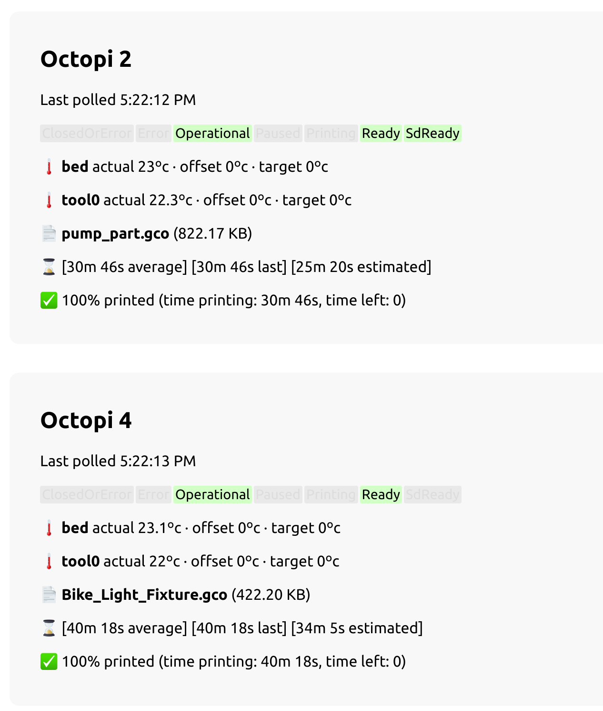

# octoprint-proxy-dashboard

Proxy server and UI for multiple Octoprints, with webcam snapshots. Made for MakeHaven.

Three services:
* **api (clojure)** for each configured Octoprint, polls `cam` server on interval if available (for webcam snapshots), and subscribes to the Octoprint Push Update servers, broadcasting all relevant changes to clients via its own websocket server.
* **cam (clojure)** simple webcam service to be installed on 3d printer pis alongside octoprint. On command, it requests a frame from the webcam (using FFmpeg), and returns a base64-encoded representation of the image.
* **front-end (javascript)** simple react front-end that connects to `api` via websocket and receives updates on individual octoprint/`cam` servers, reflecting changes immediately to the ui.

## Running With Docker

First, build and tag docker images (Dockerfiles located in `api` and `cam`).

Example run `cam`:

`DEVICE=/dev/video0 eval 'docker run --rm -it -p 8020:8020 --device $DEVICE:$DEVICE cam --device $DEVICE'`

(bind host DEVICE to container DEVICE, then supply DEVICE name to server)

Example run `api`:

`docker run --rm -it --network host -v $HOME:/configs api -c /configs/octoprint-api-config.json`

(assuming there's a file `octoprint-api-config.json` in the host's $HOME directory)

## Contributing

1. Fork it!
2. Create your feature branch: `git checkout -b my-new-feature`
3. Commit your changes: `git commit -am 'Add some feature'`
4. Push to the branch: `git push origin my-new-feature`
5. Submit a pull request

## Credits

* Andrew Suzuki - @andrewsuzuki - [andrewsuzuki.com](http://andrewsuzuki.com)

## License

MIT
